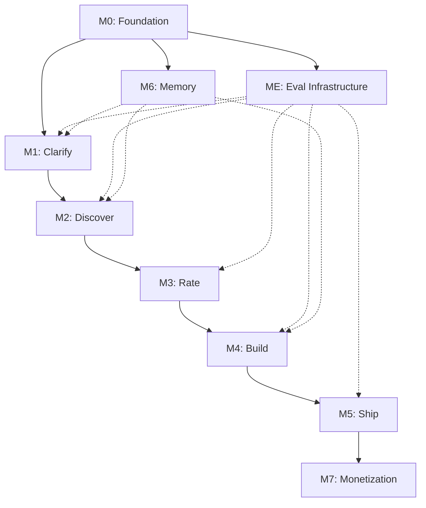

# Snapfzz Startup Launcher — Milestone Plan

> Intelligence Startup Builder. From idea to shipped business.
> Built on AgentScope (Python runtime) + Spark Design (React UI) + Tauri (desktop shell).

## Vision

You have an idea. The launcher clarifies it, finds existing solutions, rates them against your philosophy, builds what matches your needs from the best-fit OSS, and ships it — deploy, legal, payments, done.

**The user's journey:**
```
IDEA → CLARIFY → DISCOVER → RATE → BUILD → SHIP
```

**The builder's conviction (P2):** This is the exact workflow you do every day. Research → evaluate → build → ship. The product IS the process, automated.

## Strategic Lock-in: AgentScope as the Intelligence Layer

**This product is locked into AgentScope intentionally.** AgentScope is not a swappable dependency — it IS the intelligence. Every agent, every workflow, every eval, every tool call runs through AgentScope's primitives.

**Why lock in:**
- AgentScope handles everything we need for intelligence: agent loops, multi-agent coordination, tool orchestration, MCP, sessions, evaluation, tracing, A2A protocol
- Switching frameworks mid-build would mean rewriting every agent, every pipeline, every eval benchmark — that's the entire product
- Apache 2.0 license means we can fork if Alibaba makes hostile changes (but we'd rather contribute upstream)
- The eval framework (`MetricBase`, `BenchmarkBase`, `GeneralEvaluator`, `RayEvaluator`, OpenJudge integration) is critical infrastructure we'd otherwise have to build from scratch
- AgentScope's Spark Design UI library is purpose-built for LLM apps — no other design system offers this

**What we get by locking in:**
- Multi-agent pipelines: `sequential_pipeline`, `fanout_pipeline`, `MsgHub`
- Agent primitives: `ReActAgent`, hooks, middleware, state/session management
- Tool ecosystem: MCP native, built-in code/file/shell tools
- Evaluation: `MetricBase` + `BenchmarkBase` + `GeneralEvaluator` + `RayEvaluator` + OpenJudge (50+ graders)
- Tracing, RAG, embeddings, TTS, A2A protocol
- Spark Design + Spark Chat UI components

**Lock-in risk is acceptable because:**
- Apache 2.0 = we can fork the entire framework if needed
- AgentScope is backed by Alibaba Cloud (not going away)
- The alternative (framework-agnostic) means building everything ourselves — that's slower and worse

## Architecture

```
┌──────────────────────────────────────────────────┐
│  Tauri Desktop Shell                             │
│  ┌────────────────────────────────────────────┐  │
│  │  React UI (@agentscope-ai/design + /chat)  │  │
│  │  Pages: Idea → Discover → Rate → Build → Ship│ │
│  └──────────────────┬─────────────────────────┘  │
│                     │ localhost :8000 HTTP/SSE    │
│  ┌──────────────────▼─────────────────────────┐  │
│  │  AgentScope Runtime (Python)               │  │
│  │  Agents: Clarify → Discover → Rate →       │  │
│  │          Build → Ship → Eval               │  │
│  │  Tools: GitHub MCP, Filesystem, Shell,     │  │
│  │         Browser, Stripe, Vercel            │  │
│  │  Eval: MetricBase + OpenJudge (50+ graders)│  │
│  │  LLM: gateway default / BYOK              │  │
│  │  Memory: JSONSession (context accumulation)│  │
│  └────────────────────────────────────────────┘  │
└──────────────────────────────────────────────────┘
```

## Tech Stack

| Layer | Technology | License |
|---|---|---|
| Desktop shell | Tauri v2 | MIT |
| UI components | @agentscope-ai/design | MIT |
| Chat components | @agentscope-ai/chat | Apache 2.0 |
| Base UI | Ant Design 5 | MIT |
| Styling | Tailwind CSS | MIT |
| Agent runtime | AgentScope | Apache 2.0 |
| LLM gateway | llm.solo.engineer (default) | Yours |
| Local models | Ollama (optional) | MIT |

---

## Milestones

### M0: Foundation — The Skeleton

**What ships:** Empty Tauri app with Spark Design UI, AgentScope sidecar launching on startup, and a single round-trip proving they talk to each other.

**Success criteria:**
- Tauri app opens a window with Spark Chat's `ChatAnywhere` component
- User types a message → hits AgentScope at :8000 → streams a response back
- AgentScope uses the LLM gateway (`llm.solo.engineer`) for inference
- BYOK toggle in settings (user pastes their own OpenAI/Anthropic key)
- Clean shutdown: Tauri kills AgentScope child process on exit

**Implementation units:**
- [ ] Tauri v2 project scaffold (Rust + React + pnpm)
- [ ] Install `@agentscope-ai/design` + `@agentscope-ai/chat`
- [ ] AgentScope Python server with `/v1/chat/completions` SSE endpoint
- [ ] Tauri Rust command to spawn AgentScope as child process
- [ ] React `ChatAnywhere` wired to `localhost:8000`
- [ ] Settings page: LLM gateway URL + API key (stored in Tauri secure store)
- [ ] AgentScope reads gateway config from a shared config file or env
- [ ] Health check: UI shows connection status to AgentScope

**Key decisions:**
- AgentScope serves OpenAI-compatible `/v1/chat/completions` so the Spark Chat transport works unchanged
- Config shared via a JSON file in the app data directory, read by both Tauri and Python
- No database yet — all state in memory + JSONSession files

---

### M1: Clarify — The Interview

**What ships:** When a user types an idea, the ClarifyAgent interviews them to produce a structured requirements document.

**Success criteria:**
- User types "I want to build a Stripe Atlas alternative"
- ClarifyAgent asks 3-5 targeted questions (who, what, why, constraints, differentiator)
- User answers in natural language
- Agent produces a structured requirements doc (markdown) saved to the project workspace
- Requirements doc is visible in the UI as a formatted card

**Implementation units:**
- [ ] `ClarifyAgent` (AgentScope `ReActAgent` subclass) with interview system prompt
- [ ] Interview flow: sequential questions with adaptive follow-ups
- [ ] Requirements document template (markdown with sections: Problem, Users, Core Features, Constraints, Differentiator)
- [ ] Project workspace directory created per session (stores all artifacts)
- [ ] UI: requirements card rendered from markdown (Spark Chat `Markdown` component)
- [ ] User can edit the requirements before proceeding

---

### M2: Discover — Find What Exists

**What ships:** Given requirements, the DiscoverAgent searches GitHub for existing OSS projects that match, and presents them as comparison cards.

**Success criteria:**
- Agent takes the requirements doc as input
- Searches GitHub via MCP (repos, README content, stars, license, activity)
- Returns 3-7 candidates ranked by relevance
- Each candidate shown as a card: name, stars, license, description, last commit, match score
- User can click to expand and see README summary

**Implementation units:**
- [ ] `DiscoverAgent` with GitHub search tool (MCP or direct API)
- [ ] Search strategy: keyword extraction from requirements → GitHub search → filter by license + activity + stars
- [ ] README summarization (LLM pass on each candidate's README)
- [ ] Match scoring: requirements overlap, tech stack fit, license compatibility, community health
- [ ] UI: discovery results as Spark Design cards in a grid
- [ ] UI: expand card to see full README summary + link to GitHub
- [ ] Filter controls: license type, minimum stars, language

---

### M3: Rate — P1-P4 Scoring + Diff

**What ships:** Each discovered project gets scored against DoThingsRight philosophy. User sees side-by-side comparison with custom fit ratings.

**Success criteria:**
- `RateAgent` evaluates each candidate against P1 (scalable-ready), P2 (conviction match), P3 (infra potential), P4 (10-year durability)
- Each principle scored 1-10 with reasoning
- Side-by-side comparison view for top candidates
- "Custom fit" score: how much customization needed to match requirements
- User picks the winner or says "build from scratch"

**Implementation units:**
- [ ] `RateAgent` with DoThingsRight scoring prompt (P1-P4 heuristics from the framework skill)
- [ ] Per-candidate analysis: read key files (package.json/Cargo.toml/go.mod, architecture, tests) to ground the score
- [ ] Custom fit assessment: gap between requirements and what the OSS provides
- [ ] UI: comparison table with P1-P4 scores, total, custom fit percentage
- [ ] UI: expandable reasoning per principle per candidate
- [ ] "Build from scratch" option with estimated effort comparison
- [ ] User selects winner → proceeds to Build

---

### M4: Build — Multi-Agent Construction

**What ships:** Selected OSS project gets cloned, customized to match requirements, and made production-ready by a multi-agent build team.

**Success criteria:**
- Agent clones the selected repo (or scaffolds from scratch)
- `BuildAgent` (coordinator) spawns specialized workers via `fanout_pipeline`
- Workers: `ScaffoldWorker`, `CustomizeWorker`, `HardenWorker`, `TestWorker`
- Each worker operates on the local filesystem via MCP tools
- Streaming progress visible in UI (which agent is doing what)
- User can pause, review changes, approve/reject before continuing
- Result: running app locally with `npm run dev` or equivalent

**Implementation units:**
- [ ] `BuildAgent` as coordinator using `MsgHub` + `create_worker` tool pattern
- [ ] `ScaffoldWorker`: clone repo or init from template, install deps
- [ ] `CustomizeWorker`: modify code to match requirements (rename, restyle, add features)
- [ ] `HardenWorker`: add error boundaries, env var handling, input validation, security headers
- [ ] `TestWorker`: write and run basic tests, verify the app starts
- [ ] MCP tools: `execute_shell_command`, `write_text_file`, `view_text_file`
- [ ] UI: build progress panel showing agent activity stream (AGUI components)
- [ ] UI: diff view for each file change (Spark Chat `Diff` component if available, else custom)
- [ ] UI: approve/reject checkpoint between each worker phase
- [ ] Local dev server launch: agent runs `npm run dev` / `python manage.py runserver` / etc.
- [ ] UI: embedded browser preview or link to localhost

---

### M5: Ship — Deploy + Legal + Payments

**What ships:** One-click path from local running app to deployed product with legal entity and payment processing.

**Success criteria:**
- `ShipAgent` coordinates three sub-flows: Deploy, Legal, Payments
- Deploy: push to GitHub → deploy to Vercel/Fly.io/Railway (user picks)
- Legal: guided flow to set up business entity (Stripe Atlas integration or manual checklist)
- Payments: add Stripe integration to the built app (checkout page, pricing, webhook)
- Each step is optional and skippable
- Result: live URL + business entity + payment link

**Implementation units:**
- [ ] `ShipAgent` as coordinator with three optional sub-agents
- [ ] `DeployAgent`: git init → push to user's GitHub → connect to hosting provider → deploy
- [ ] Deploy targets: Vercel (Next.js), Fly.io (Docker), Railway (generic) — start with one
- [ ] `LegalAgent`: Stripe Atlas guided flow OR checklist of manual steps per jurisdiction
- [ ] `PaymentsAgent`: add Stripe to the app — pricing page, checkout session, webhook handler
- [ ] Stripe MCP tool: create products, prices, checkout sessions via Stripe API
- [ ] UI: ship dashboard with three lanes (Deploy / Legal / Payments), each with status
- [ ] UI: each lane shows progress, links, and "skip" option
- [ ] Custom domain setup guidance (DNS instructions)
- [ ] Post-ship summary: live URL, entity status, payment link, what's left

---

### ME: Eval — Intelligence Quality Gate (Cross-cutting)

**What ships:** Every agent in every milestone is evaluated. Eval is not a feature — it's the immune system. Without eval, intelligence is a guess. With eval, intelligence is a measurement.

**Why this is critical:** You cannot improve what you cannot measure. Every agent (Clarify, Discover, Rate, Build, Ship) must have benchmarks that prove it works, catch regressions, and enable systematic improvement. Eval is what separates a toy from a product.

**Two eval systems from AgentScope:**

#### 1. Native Evaluation Framework (`agentscope.evaluate`)
- `MetricBase` → custom metrics (e.g., "did the requirements doc cover all sections?")
- `BenchmarkBase` → test suites per agent (e.g., "10 known ideas → expected requirements quality")
- `GeneralEvaluator` → sequential eval for debugging
- `RayEvaluator` → parallel/distributed eval for CI and scale
- `SolutionOutput` → captures agent trajectory + final output for analysis
- `FileEvaluatorStorage` → persist results for trend tracking

#### 2. OpenJudge Integration (`py-openjudge`)
- 50+ pre-built semantic graders: Relevance, Correctness, Hallucination, Safety, Code Quality, JSON Formatting
- LLM-as-judge pattern — no hand-written rubrics needed for complex quality dimensions
- `OpenJudgeMetric` adapter wraps any OpenJudge grader as an AgentScope metric
- Graders are composable: stack Relevance + Correctness + Safety on a single agent output

**Eval per milestone:**

| Milestone | Eval Benchmarks |
|---|---|
| **M1 Clarify** | Requirements completeness metric (all sections present?), question relevance grader (OpenJudge), interview depth metric (3-5 substantive questions?) |
| **M2 Discover** | Recall metric (did it find the known-good repos from test set?), ranking quality (OpenJudge Relevance), license accuracy (binary), freshness check |
| **M3 Rate** | Scoring consistency (same project → same P1-P4 scores across runs), reasoning quality (OpenJudge Correctness), calibration (does a known-bad project score low?) |
| **M4 Build** | App starts metric (exit code 0 on `npm run dev`), test pass rate, code quality (OpenJudge Code Quality grader), security scan (OpenJudge Safety), diff size reasonableness |
| **M5 Ship** | Deploy success (HTTP 200 on live URL), Stripe webhook fires, legal checklist completeness |
| **M6 Memory** | Preference recall accuracy (after 3 projects, does it suggest the right defaults?), context retrieval relevance (OpenJudge Relevance) |

**Implementation units (threads through all milestones):**
- [ ] Install `py-openjudge` alongside AgentScope
- [ ] Create `OpenJudgeMetric` adapter (from AgentScope docs — wraps any grader as `MetricBase`)
- [ ] Create `LauncherBenchmark` base class extending `BenchmarkBase` for all launcher evals
- [ ] Per-agent benchmark datasets: curated inputs with expected outputs for each milestone
- [ ] M1 eval: `ClarifyBenchmark` — 10 diverse ideas → score requirements docs
- [ ] M2 eval: `DiscoverBenchmark` — 10 requirements → known-good repo sets → recall + ranking
- [ ] M3 eval: `RateBenchmark` — 10 repos with known P1-P4 scores → consistency + calibration
- [ ] M4 eval: `BuildBenchmark` — 5 simple apps (landing page, SaaS starter, API, CLI, bot) → does it compile + start?
- [ ] M5 eval: `ShipBenchmark` — deploy to staging → HTTP health check → Stripe test mode webhook
- [ ] CI integration: `RayEvaluator` runs full benchmark suite on every agent change
- [ ] Eval dashboard in UI: show benchmark scores over time, catch regressions
- [ ] `FileEvaluatorStorage` → persist results in project workspace for historical analysis

**Key decisions:**
- Eval runs on every agent change, not just at milestones — regressions caught immediately
- OpenJudge graders used for semantic quality (relevance, correctness, safety); custom `MetricBase` for structural checks (exit codes, file existence, completeness)
- `RayEvaluator` for CI (parallel, distributed), `GeneralEvaluator` for local debugging
- Eval datasets are versioned in the repo alongside the agents — they compound like learnings
- The LLM used for OpenJudge grading can be cheaper than the main agent LLM (Qwen for eval, Claude for build)

---

### M6: Memory — The Moat (P3)

**What ships:** Context accumulation across projects. Every project shipped through the launcher makes the next one faster and smarter.

**Success criteria:**
- User's preferences, past decisions, tech stack choices, business entity details persist
- New project: "Build another SaaS" → agent already knows preferred stack, deploy target, business entity
- Cross-project analytics: which of your launched projects has traffic/revenue
- Export: user can export their full context as a Telos-compatible file

**Implementation units:**
- [ ] `MemoryStore`: persistent context store (SQLite or file-based, upgradeable)
- [ ] Auto-capture: every decision during Clarify/Discover/Rate/Build/Ship gets logged
- [ ] Preference inference: after 2+ projects, suggest defaults ("You always pick Next.js + Vercel")
- [ ] Business entity reuse: once set up, auto-fill for subsequent projects
- [ ] Cross-project dashboard: list all launched projects with status, deploy URL, last check
- [ ] Health monitor agent: periodic check if deployed projects are still running
- [ ] Telos export: generate a `personal_telos.md` from accumulated context
- [ ] UI: memory/preferences page showing what the system knows about you

---

### M7: Monetization — Revenue Engine

**What ships:** Free tier + paid tiers. Gateway default generates revenue from day one.

**Revenue model:**
- **Free tier**: 3 projects, your own API keys (BYOK), manual deploy
- **Pro ($19/mo)**: unlimited projects, launcher gateway (your LLM cost covered), one-click deploy, memory
- **Team ($49/seat/mo)**: shared memory, team projects, org-level analytics

**Implementation units:**
- [ ] User accounts (email + password or OAuth, via OpenAuth or Supabase)
- [ ] Tier gating: project count limits, feature flags
- [ ] Stripe subscription integration (reuse PaymentsAgent infrastructure)
- [ ] Usage metering: track LLM tokens consumed per project via gateway
- [ ] Dashboard: current plan, usage, billing history

---

## Milestone Dependencies



**Critical path:** M0 → M1 → M2 → M3 → M4 → M5 → M7

**Parallel tracks:**
- ME (Eval) starts after M0, threads through every milestone — each agent gets its benchmark before shipping
- M6 (Memory) starts after M0, feeds into M1/M2/M4 as it matures

---

## P1-P4 Alignment Per Milestone

| Milestone | P1 Scalable | P2 Conviction | P3 Infra | P4 10yr |
|---|---|---|---|---|
| M0 Foundation | API-first, stateless agents | Builder uses this daily | Gateway = recurring revenue | Tauri + Python = stable |
| ME Eval | RayEvaluator = distributed | You can't ship without measuring | Eval data compounds = intelligence asset | Evaluation is permanent |
| M1 Clarify | Reusable interview protocol | Your actual workflow step 1 | Requirements as structured data | People always need to clarify ideas |
| M2 Discover | GitHub API scales infinitely | You do this manually every time | OSS index as data asset | OSS discovery is permanent |
| M3 Rate | Scoring engine is stateless | Your P1-P4 framework encoded | Scoring data compounds | Evaluation never goes away |
| M4 Build | Agents are horizontal | The core product value | Code customization as service | Code generation improves forever |
| M5 Ship | Deploy providers are pluggable | You ship things constantly | Deploy + legal + payments lock-in | Shipping products is permanent |
| M6 Memory | SQLite → Postgres migration path | Context compounds with use | **THE MOAT** — leaving loses all context | Memory gets more valuable over time |
| M7 Revenue | Stripe scales infinitely | Dogfood your own payment flow | Gateway metering = infra revenue | SaaS billing is permanent |

---

## Risks

| Risk | Impact | Mitigation |
|---|---|---|
| AgentScope is Alibaba-centric, thin on local-model testing | Build agents fail with non-DashScope models | Test with OpenAI-compat gateway from M0. File issues upstream. Lock-in is intentional — Apache 2.0 means we can fork if needed. |
| Spark Design is new (339 stars), may have gaps | UI blockers during build | Fall back to raw Ant Design 5 for missing components. Both MIT. |
| Multi-agent build quality (M4) is the hardest unsolved problem | Built apps don't actually work | Human-in-the-loop checkpoints. Start with simple apps (landing pages, SaaS starters). Expand scope as quality improves. |
| Stripe Atlas integration may require partnership | Legal flow is incomplete | Start with manual checklist. Automate incrementally. Stripe Atlas has an API. |
| LLM cost per project could be high | Free tier unsustainable | Gateway metering from day one. Token budget per project. Cheaper models for discovery/rating, expensive for build. |

---

## What Gets Built by AI Agents

Everything. Each milestone's implementation units are designed to be executed by AI agents (via `ce:work`, subagent dispatch, or AgentScope's own agents). The human (you) reviews, approves, and steers. The agents write code, tests, and configs.

This plan is the input. AI agents are the labor. Your philosophy is the quality gate.
